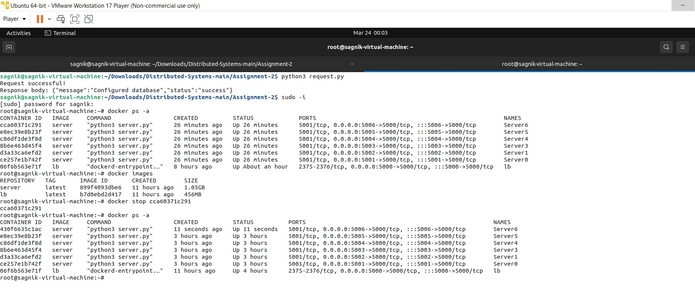
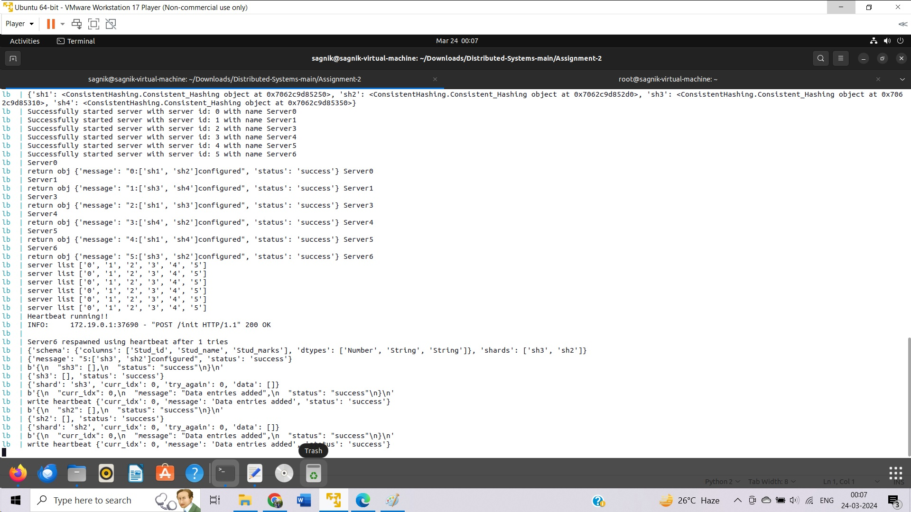

# DISTRIBUTED SYSTEMS ASSIGNMENT 2
In the second assignment we implement a sharded database that stores only one table in multiple shards distributed across several server containers.There are several endpoints to handle requests to a specific server.
We also improve the load balancer from the previous assignment and finally analyse the performance of the developed distributed database.

## Run the following command to build the docker image of load balancer and server
```bash
sudo make build
```
## Run the following command to start the load balancer container
```bash
sudo make lb
```
## Run the following command to start the server containers
```bash
python3 request.py
```
# Following are some of the observations and analysis for the developed distributed database. <br />
## A-1 : Report the read and write speed for 10000 writes and 10000 reads in the default configuration given in task 2. <br />
## A-2 : Increase the number of shard replicas (to 7) from the configuration (init endpoint). Report the write speed down for 10000 writes and read speed up for 10000 reads
## A-3 : Increase the number of Servers (to 10) by adding new servers and increase the number of shards (shard to 6, shard replicas to 8). Define the (init endpoint) configurations according to your choice. Report the write speed up for 10000 writes and read speed up for 10000 reads
## A-4 : Finally, check all the endpoints and ensure their correctness. Manually drop a server container and show that the loadbalancer spawns a new container and copies the shard entries from other replicas
The endpoints are working fine and correctly.We manually removed a server container. The load balancer spawns a new container and copies the shard entries from other replicas. The images below depict this.
<br />
<br />

<br />
<br />


<br />
