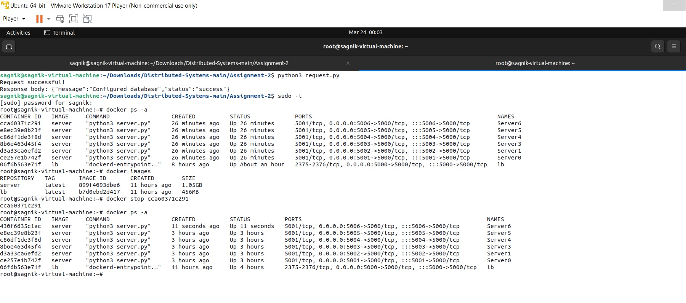
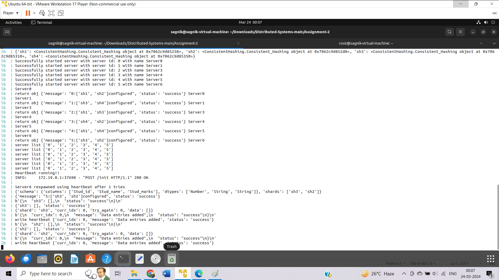

# DISTRIBUTED SYSTEMS ASSIGNMENT 3
In the second assignment we implement a sharded database that stores only one table in multiple shards distributed across several server containers.There are several endpoints to handle requests to a specific server.
We also improve the load balancer from the previous assignment and finally analyse the performance of the developed distributed database.

## Run the following command to build the docker image of load balancer and server
```bash
sudo make build
```
## Run the following command to start the load balancer container
```bash
sudo make lb
```
## Run the following command to start the server containers
```bash
python3 request.py
```

# Assumptions, Design Choices and Implementation Details
## Assumptions
1. The server containers are running on the same machine.
2. The servers contains multiple shards and each shard has multiple replicas.
3. The load balancer is running on the same machine as the server containers.

## Design of Load Balancer
The load balancer is implemented using FastAPI.
Heartbeat runs in the background and checks the health of the servers periodically. If a server is down, the load balancer will keep trying to spawn the server again for specific number of time and copy the shard entries from other replicas. If it fails to spawn the server, it will remove the server from the database.


# Following are some of the observations and analysis for the developed distributed database. <br />
## A-1 : Report the read and write speed for 10000 writes and 10000 reads in the default configuration given in task 2. <br />
We managed to read and write for 10000 data points. The read speed was 360.45seconds and write speed was 526.77 seconds.
<br />

## A-2 : Increase the number of shard replicas (to 7) from the configuration (init endpoint). Report the write speed down for 10000 writes and read speed up for 10000 reads
We increased the shard replicas to 7 in the init endpoint. There was some fluctuation in the read and write speed. The read speed was 367.55seconds and write speed was 1125.44seconds.
<br />

## A-3 : Increase the number of Servers (to 10) by adding new servers and increase the number of shards (shard to 6, shard replicas to 8). Define the (init endpoint) configurations according to your choice. Report the write speed up for 10000 writes and read speed up for 10000 reads
We now increased the number of servers to 10 and increased shards to 8. The read speed was 375.65seconds and write speed 1022.70 seconds 

## A-4 : Finally, check all the endpoints and ensure their correctness. Manually drop a server container and show that the loadbalancer spawns a new container and copies the shard entries from other replicas
The endpoints are working fine and correctly.We manually removed a server container. The load balancer spawns a new container and copies the shard entries from other replicas. The images below depict this.
<br />
<br />

<br />
<br />


<br />
