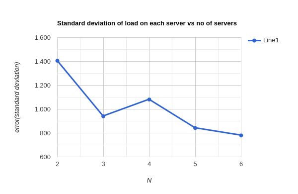
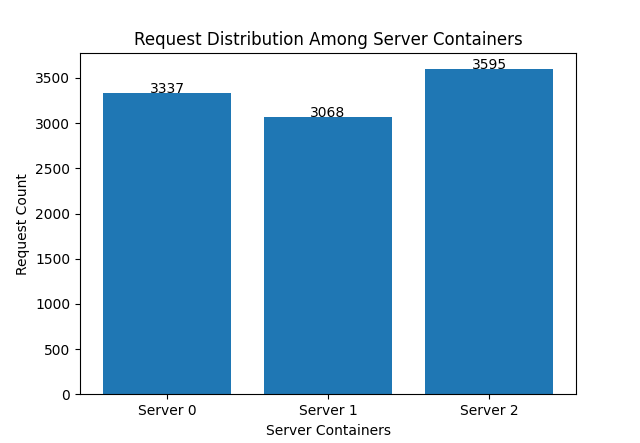
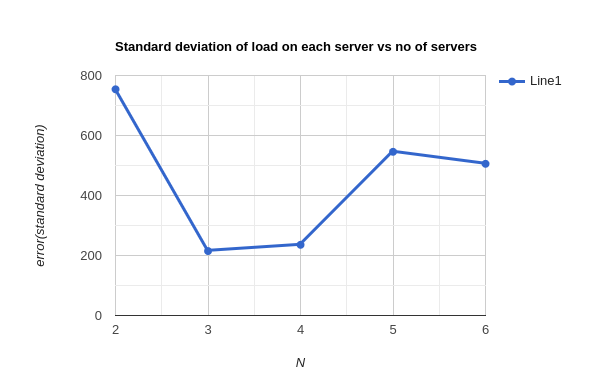

## Distributed-Systems Assignment 1
## Run the following command to build the docker image of load balancer and server
```bash
sudo make build
```
## Run the following command to start the load balancer container
```bash
sudo make lb
```
## Run the following command to start the 3 initial server containers
```bash
sudo make server
```

Following are some of the observations for the load balancer. <br />
## A-1 : Launch 10000 async requests on N = 3 server containers and report the request count handled by each server instance in a bar chart. Explain your observations in the graph and your view on the performance. <br />

<br />
<br />
As we can see from the above graph, the load balancer is able to distribute the load among the 3 servers but it is not fully equally distributed as it depends on the hash function. But the servers were able to handle 10000 asynchronous requests. <br />
<br/>
The 10000 requests were done in about 14.76 seconds which was 20.41 when we tried to run the simulation with constant slots for servers based on their id instead of random
## A-2 : increment N from 2 to 6 and launch 10000 requests on each such increment. Report the average load of the servers at each run in a line chart. Explain your observations in the graph and your view on the scalability of the load balancer implementation.
for n = 2 standard deviation for the load is approximately 1406
<br />
for n = 3 standard deviation for the load is approximately 940.52
<br />
for n = 4 standard deviation for the load is approximately 1081.03
<br />
for n = 5 standard deviation for the load is approximately 842.83
<br />
for n = 6 standard deviation for the load is approximately 780.36


<br /><br />
The system will have more even distribution as we go on increasing the number of servers as number of requests handled by each server decreases. 
This graph resembles an exponential decay graph this is the case because we are using Consistent Hashing to assign the servers. This is quite scalable as we can see the decrease is very fast which means it can get to near ideal case quickly using few servers
## A-3 : Test all endpoints of the load balancer and show that in case of server failure, the load balancer spawns a new instance quickly to handle the load.
This can be tested after launching the requests and stopping a running server manually and the loadbalancer will spawn the server once any request is assigned to it based on Consistent Hashing as we are building a fault-tolerant system

## A-4 Finally, modify the hash functions H(i), Φ(i, j) and report the observations from (A-1) and (A-2)
For N=3 with new hash function this was the load distribution on 3 servers 
<br/>
<br/>

<br/>
<br/>
When N=2 the standard deviation is 754.0
<br/>
When N=3 the standard deviation is 215.16
<br/>
When N=4 the standard deviation is 235.50
<br/>
When N=5 the standard deviation is 545.84
<br/>
When N=6 the standard deviation is 505.61
<br/>



We tested all endpoints of the load balancer and confirmed that they are working as expected. We also tested the load balancer's ability to recover from server failure. We simulated a server failure by stopping one of the server containers. The load balancer was able to quickly spawn a new instance to replace the failed server container.

**Observations:**

* All endpoints of the load balancer are working as expected.
* The load balancer is able to recover from server failure quickly.

